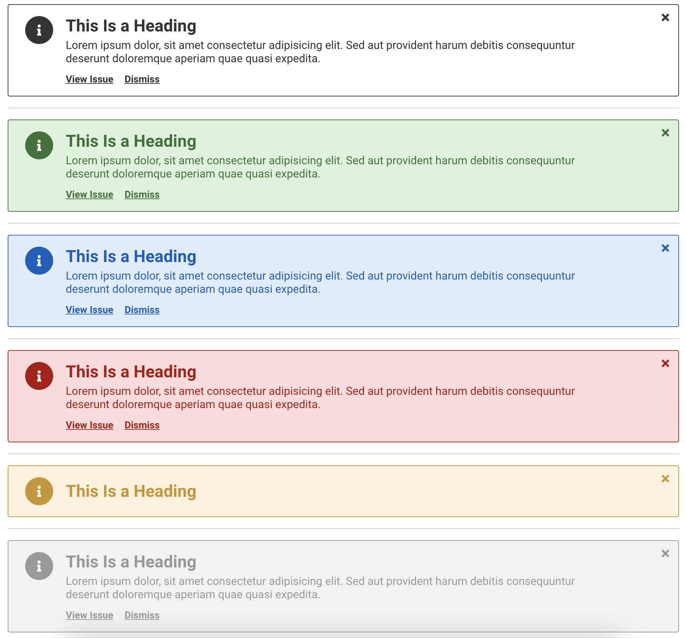

# Alert Notifications

[](https://www.npmjs.org/package/elr-scss-alerts)
[](https://github.com/Beth3346/elr-scss-alerts/actions/workflows/node.js.yml)
[](https://opensource.org/licenses/MIT)
[](https://npmjs.com/package/elr-scss-alerts)
[](https://github.com/Beth3346/elr-scss-alerts)
[](https://app.netlify.com/sites/elr-alerts/deploys)

scss mixin for alerts

This package includes some JavaScript and HTML for demo purposes. It's intended for use with a library or framework such as React or Vue. It's up to you to build the HTML and JavaScript.

[View Demo](https://elr-alerts.netlify.app/)

## Screenshots



## Installation

Download node at [nodejs.org](http://nodejs.org) and install it, if you haven't already.

```sh
npm install elr-scss-alerts --save
```

or

```sh
yarn add elr-scss-alerts
```

## Implementation

### Scss

```scss
@import "elr-scss-alerts";

.alert {
  @include elr-alert;
}
```

```scss
@import "elr-scss-alerts";

.alert-info {
  @include elr-alert-context(
    $config: (
      type: info,
    )
  );
}
```

```scss
@import "elr-scss-alerts";

.alert-danger {
  @include elr-alert-context(
    $config: (
      type: danger,
    )
  );
}
```

```scss
@import "elr-scss-alerts";

.alert-warning {
  @include elr-alert-context(
    $config: (
      type: warning,
    )
  );
}
```

```scss
@import "elr-scss-alerts";

.alert-success {
  @include elr-alert-context(
    $config: (
      type: success,
    )
  );
}
```

```scss
@import "elr-scss-alerts";

.alert-muted {
  @include elr-alert-context(
    $config: (
      type: muted,
    )
  );
}
```

### HTML

```html
<div class="alert js-alert">
  <button class="button-close js-button-close">&times;</button>
  <span class="icon">
    <i class="fa fa-info"></i>
  </span>
  <div>
    <h3 class="notification-heading">This Is a Heading</h3>
    <p>
      Lorem ipsum dolor, sit amet consectetur adipisicing elit. Sed aut
      provident harum debitis consequuntur deserunt doloremque aperiam quae
      quasi expedita.
    </p>
    <div class="button-holder">
      <a href="#">View Issue</a>
      <button class="js-button-close">Dismiss</button>
    </div>
  </div>
</div>
```

## Road Map

- add mixin for toast notifications
- add mixin for notifications with overlay

## License

SEE LICENSE IN LICENSE.md
